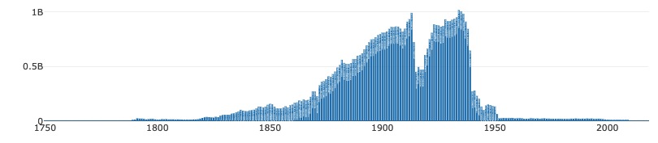
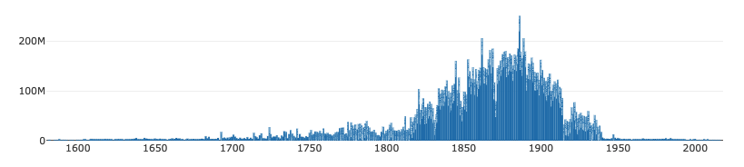
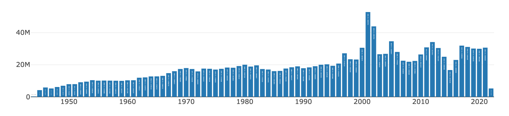

# pyllicagram
Un micro package python pour importer des données de [Gallicagram](https://shiny.ens-paris-saclay.fr/app/gallicagram).

## Installation
Tout simplement :
```console
$ pip install pyllicagram
```

Ou, si vous préférez la subtilité, vous pouvez cloner ce github et vous diriger dans le dossier créé :
```console
$ git clone https://github.com/regicid/pyllicagram
$ cd pyllicagram
```
Vous pouvez maintenant lancer python (dans ce directory!)

## Usage dans python
Importez la fonction avec :
```python
from pyllicagram import pyllicagram
```

Vous pouvez l'utiliser comme ceci:
```python
pyllicagram(recherche="francis",corpus="presse",debut=1789,fin=1950,resolution="annee")
```
Le seul argument nécessaire est `recherche`. Par défaut, la fonction cherche dans le corpus de presse de Gallica, de 1789 à 1950, en résolution mensuelle. Si vous ne spéficiez pas la résolution, la résolution la plus fine disponible est utilisée.

La fonction vous retourne un tableau pandas, avec pour colonnes le nombre d'occurrences (`n`), le nombre total de mots sur la période (`total`), la fréquence du mot calculée comme le rapport des deux (`ratio`), le syntagme recherché (`gram`), l'année (`annee`) et selon la résolution le `mois` et le `jour`.

Pour rechercher plusieurs syntagmes, vous pouvez passer une liste dans l'argument `recherche`. 
```python
pyllicagram(["francis","roger"])

```
En spécifiant `somme = True` dans la fonction, elle retournera la somme des fréquences des mots recherchés, ce qui correspond à la recherche "francis+roger" dans l'interface graphique de Gallicagram.

## Corpus
Ce package permet seulement de chercher dans les corpus qui ont été tokénisés pour le projet Gallicagram, c'est-à-dire :
* La presse de Gallica (corpus="presse"). 3 millions de numéros, fiable à partir de 1789 et jusqu'en 1950 (la faute aux droits d'auteur). Résolution mensuelle.

* Les livres de Gallica (corpus="livres"). 300 000 "monographies", de plus en plus fiable au fil des XVIIe et XVIIIe siècle, et ce jusqu'en 1950 (même raison). Résolution annuelle.

* Les archives du Monde de décembre 1944 au 22 février 2022 (corpus="lemonde"). Fiable tout au long de la période, résolution journalière. Impeccablement océrisé, contrairement à Gallica.

## Pour les passionnés
Plus d'informations dans notre [preprint](https://osf.io/preprints/socarxiv/84bf3/) consacré au projet et dans la notice du [site](https://shiny.ens-paris-saclay.fr/app/gallicagram).

## Usage en ligne de commande
Grâce à [Laurent Vanni](https://github.com/lvanni/), vous pouvez utiliser le programme directement en ligne de commande et génère un fichier "results.csv" où les valeurs sont séparées par des tablulations. Pour ce faire, clonez (ou si vous êtes un barbare, téléchargez) ce Github, et allez dans le directory pyllicagram (ou, cela revient au même, bougez le fichier pyllicagram.py dans le directory où vous souhaitez l'utiliser). Puis, pour la recherche d'un mot :
```console
$ python3 pyllicagram.py france
```

Pour la recherche de plusieurs mots (séparés par des virgules) :
```console
$ python3 pyllicagram.py france,nation
```

Pour la recherche de la somme de plusieurs mots (séparés par des +):
```console
$ python3 pyllicagram.py france+nation
```

Pour la recherche d’une expression (entre guillemets) : 
```console
$ python3 pyllicagram.py "la france"
```

Pour passer les options :

Choix du corpus parmi [lemonde, livres, presse] (presse par défaut) :
```console
$ python3 pyllicagram.py france -c livres
```

Choix de la date de début (1789 par défaut) :
```console
$ python3 pyllicagram.py france -d 1800
```

Choix de la date de fin (1950 par défaut) :
```console
$ python3 pyllicagram.py france -d 1900
```

Choix de la resolution parmi [default, annee, mois] :
```console
$ python3 pyllicagram.py france -r annee
```

Vous pouvez mélanger les options :
```console
$ python3 pyllicagram.py france -d 1800 -f 1900 -r annee 
```
